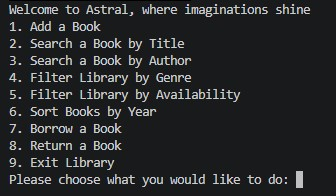
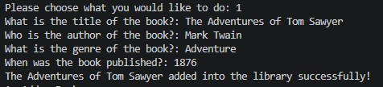
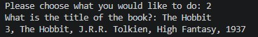
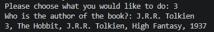
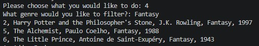
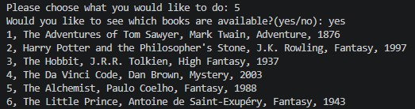
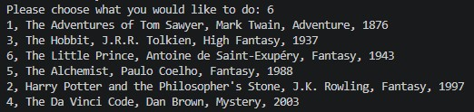
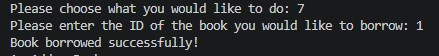
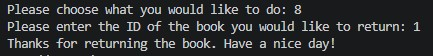

# Library System

## Features
- Add a Book with Title, Author, Genre, and Year
- Search a Book by Title
- Search a Book by Author
- Filter the Library by Genre
- Filter the Library by Availability
- Sort the Books by Year
- Borrow a Book
- Return a Book

## How to Run
- Clone the repository
- Navigate to the library-system folder
- Run `python main.py`

## What I learned
- Applied Class Composition - Book and Library each handle a distinct responsibility with their assigned attributes and methods through which they interact with each other.
- Applied Encapsulation to keep the data and logic that acts on it inside the class that owns it. No unnecessary data for the main loop that it doesn't need to run.
- Implemented ID Collision prevention using the max ID method. This ensures that the next id that will be assigned will be plus 1 of the highest existing ID in the list.
- Implemented serialization and deserialization using `to_dict` and `from_dict` to convert objects to JSON-storable format such as dictionaries and to convert back to an object.
- Demonstrated Unit Testing for isolation and testing the methods independently to find errors. 
- Implemented Test Fixtures (setUp and tearDown) for preparation and cleaning up of the test environment before and after each test to keep real data isolated.
- Implemented Happy Path and Failure Path to ensure the code handles both successful and unsuccessful cases correctly.

## Preview

