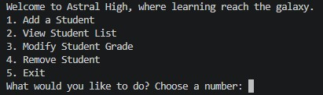
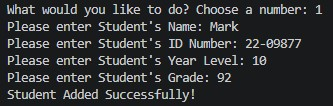
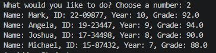
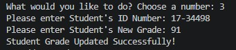
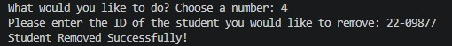

# Student Record System

## Features
- Add a Student
- View the Students List
- Change a Student's Grade
- Remove a Student

## How to Run
- Clone the repository
- Navigate to the student-record folder
- Run `python main.py`

## What I learned
- Applied Class Composition - Student, StudentRegistry, and FileManager each handle a distinct responsibility with their assigned attributes and methods through which they interact with each other.
- Applied Encapsulation to keep the data and logic that acts on it inside the class that owns it. No unnecessary data for the main loop that it doesn't need to run.
- Implemented ID Collision prevention using the max ID method. This ensures that the next id that will be assigned will be plus 1 of the highest existing ID in the list.
- Implemented serialization and deserialization using `to_dict` and `from_dict` to convert objects to JSON-storable format such as dictionaries and to convert back to an object.

## Preview

